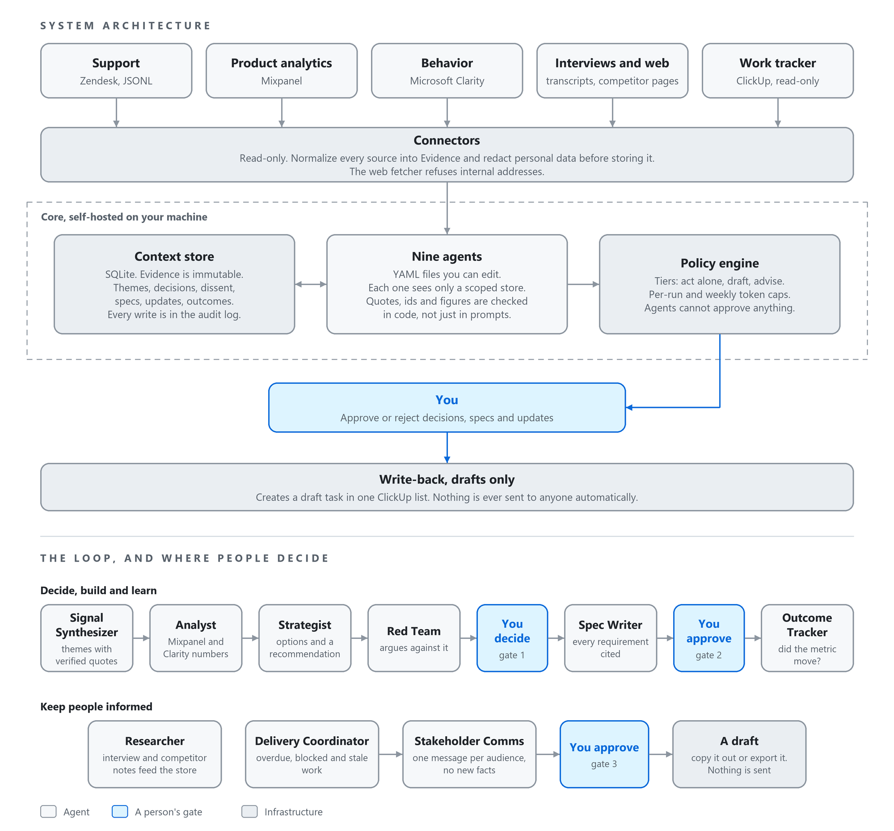

# Multi-Agent System for Product Teams

A self-hosted set of AI agents for the product loop: collect customer signal, spot what is changing,
decide with a written rationale, turn the decision into a spec, and check later whether it worked.
It is built for teams of one to ten, and it is designed so that **people decide and agents prepare**.

> **Status: pre-alpha (0.1.0a1).** All nine agents and the human gates are implemented.
> Interfaces will change before 1.0. See [Status](#status) and
> [Check it on your own setup first](#check-it-on-your-own-setup-first).

## Who it is for

Product managers and small product teams who already use a support tool, product analytics and a
work tracker, and want help turning that signal into decisions without giving up control of them.
The reference connectors cover Zendesk, Mixpanel, Microsoft Clarity and ClickUp. Others can be
added by writing a connector (see [docs/connector-spec.md](docs/connector-spec.md)).

It is **not** a hosted service, it does not write or deploy code, it does not reply to customers,
and it never sends anything to anyone on its own.

## What makes it different from agent frameworks for developers

Code has a compiler and a test suite. Product judgment does not, so trust comes from structure:

- **Every claim traces to evidence.** Themes carry quotes, and a quote is kept only if it appears
  verbatim in the record it cites. Decisions and spec requirements cite evidence ids the model was
  actually shown. Anything unsupported is labeled an assumption, and cannot be hidden.
- **People decide, and the system enforces it.** Agents only receive a scoped store with no approve
  method. Approving a decision, approving a spec and exporting it are separate human commands that
  record who did them. A decision cannot be approved until the Red Team has dissented (waivable,
  and the waiver is logged), and the database refuses approval of a decision with no evidence unless
  a person marks it an explicit assumption.
- **Numbers come from connectors, not from the model.** The model only chooses *which* of your
  listed events and pages are relevant. The counts are fetched and stored as metric evidence.
- **Source text is hostile.** Tickets and transcripts can contain instructions aimed at the agent.
  They reach the model only as quoted data, and an agent that reads them cannot hold a write connector.
- **Personal data is redacted before storage,** inside the connector.
- **Data stays on your machine.** The only outbound flow is redacted text to the model provider you choose.

## System design



## The loop

```
Zendesk / files ──► Signal Synthesizer ──► themes with verified quotes
Mixpanel, Clarity ─► Analyst ─────────────► numbers attached to the top themes
                     Strategist ──────────► draft decision: options, recommendation, hypothesis, metric
                     Red Team ────────────► dissent attached to the decision
        YOU ──────► approve / reject ─────► gate 1 (a person)
                     Spec Writer ─────────► draft spec, every requirement cited or labeled an assumption
        YOU ──────► approve spec, export ─► gate 2 (a person): a draft task in your ClickUp drafts list
                     Outcome Tracker ─────► at the review date: did the metric move? (no model involved)

Interviews, competitor pages ► Researcher ► notes: every finding has a verbatim quote
ClickUp (read-only) ─────────► Delivery Coordinator ─► status update: overdue, blocked, stale work
                     Stakeholder Comms ───► the same update rewritten per audience, no new facts
        YOU ──────► approve update, export ─► a person's gate: nothing is ever sent automatically
```

## The nine agents

Each is a YAML file you can edit, and each runs under a policy that limits what it can read and write.
Tier **A** acts alone, **B** only drafts for a person to approve, **C** only advises.

| Agent | Job | Tier |
| --- | --- | --- |
| Signal Synthesizer | Groups customer tickets into themes with counts, trend and verified quotes | A |
| Analyst | Attaches Mixpanel and Clarity numbers to the top themes, from your event dictionary | A |
| Strategist | Drafts a decision: options, a recommendation, a hypothesis and a metric | B |
| Red Team | Argues against the draft decision before you see it | C |
| Spec Writer | Drafts a spec from an approved decision, citing evidence for every requirement | B |
| Outcome Tracker | Checks the decision's metric at the review date (deterministic, no model) | B |
| Researcher | Notes from interviews and competitor pages, each finding with a verbatim quote | B |
| Delivery Coordinator | Status update from ClickUp: overdue, blocked and stale work | B |
| Stakeholder Comms | Rewrites one update per audience without adding facts | B |

## What is included

| Piece | Notes |
| --- | --- |
| Store | SQLite. Evidence is immutable. Decisions, dissent, specs, updates, research notes, outcomes and an audit log |
| Policy engine | Tiers, scoped access, per-run token budgets, a weekly cap |
| Connectors | Zendesk, JSONL, folder of transcripts, web pages (SSRF-guarded), Mixpanel, Microsoft Clarity, ClickUp (task reader, and a writer that can only create drafts) |
| Agents | The nine above. Quotes, evidence ids and figures are checked in code, not just in prompts |
| Gates | Approve or reject decisions, specs and updates. Each records who acted |
| Weekly run | `run weekly` runs the steps in order and reports each one |
| Redaction | Emails, phone numbers, card numbers, IP addresses. **Names are not detected** |
| Not included | A scheduler (use cron or Task Scheduler), a hosted option, and sending anything to people: updates are drafts you copy out or export as a ClickUp draft |

## Quick start

Requires Python 3.11 or newer.

```bash
pip install -e .
product-agents init my-workspace
cd my-workspace
export ANTHROPIC_API_KEY=...        # PowerShell: $env:ANTHROPIC_API_KEY = "..."

# 1. Tell the agents what you are trying to achieve (only a person can change this)
#    Edit strategy.md, then:
product-agents strategy set strategy.md --by YOUR_NAME

# 2. Try it on the synthetic demo data (no real customer data involved)
product-agents ingest jsonl ../examples/demo/tickets.jsonl
product-agents synthesize
product-agents digest --now 2026-10-01T12:00:00Z

# 3. Decide
product-agents propose --now 2026-10-01T12:00:00Z    # Strategist drafts decisions
product-agents redteam                               # Red Team dissents
product-agents decisions list
product-agents decisions show <id>                   # recommendation + dissent + evidence on one page
product-agents decisions approve <id> --by YOUR_NAME # or: reject <id> --by YOU --reason "..."

# 4. Specify and hand off
product-agents specwrite
product-agents specs show <spec-id>
product-agents specs approve <spec-id> --by YOUR_NAME
product-agents specs export <spec-id> --by YOUR_NAME # creates a DRAFT task in ClickUp

# 5. Learn
product-agents outcomes                              # decisions due for review

# 6. Research (optional)
product-agents ingest folder interviews/             # transcripts as .txt or .md
product-agents ingest web urls.txt                   # competitor pages you may read, one URL per line
product-agents research run
product-agents research show <note-id>               # findings, each with a verbatim quote

# 7. Keep people informed (optional)
product-agents delivery                              # status update from ClickUp (needs the reader variables below)
product-agents comms --update <update-id>            # or: comms --recent 14 for decisions and outcomes
product-agents updates list
product-agents updates show <id>
product-agents updates approve <id> --by YOUR_NAME   # a person's gate. Nothing is sent
product-agents updates export <id> --by YOUR_NAME    # optional: a DRAFT task in ClickUp
```

`--now` matters only for the demo: the sample tickets are dated around 1 October 2026. With real
data, omit it.

### Connecting real tools

Credentials come from environment variables. Use the least access that works.

| Tool | Variables | Notes |
| --- | --- | --- |
| Zendesk | `ZENDESK_SUBDOMAIN`, `ZENDESK_EMAIL`, `ZENDESK_API_TOKEN` | Read-only: only GET requests |
| Mixpanel | `MIXPANEL_PROJECT_ID`, `MIXPANEL_SA_USERNAME`, `MIXPANEL_SA_SECRET`, `MIXPANEL_REGION` (us, eu or in) | Service account with read access |
| Clarity | `CLARITY_API_TOKEN` | Its export API is rate-limited and covers only recent days |
| ClickUp (drafts) | `CLICKUP_API_TOKEN`, `CLICKUP_DRAFTS_LIST_ID` | The writer can only create a task in that one list |
| ClickUp (read) | `CLICKUP_API_TOKEN`, `CLICKUP_BACKLOG_LIST_IDS` (comma-separated) | The reader only lists open tasks in those lists |

Edit `audiences.yaml` to change who Stakeholder Comms writes for. For competitor scans, put the
URLs in a text file you control. The web fetcher only accepts public http and https pages on
ports 80 and 443, and refuses anything that resolves to an internal address.

List the events and pages the Analyst may use in `events.yaml`. Nothing outside that list can be queried.
`product-agents run weekly` does ingest, synthesize, research (when there is new interview or web
material), analyse, outcome checks, delivery (when ClickUp is configured) and the digest in one go. It
reports each step separately so one failure does not hide the others. It does not schedule itself:
call it from cron, Task Scheduler or a CI job.

### What the model sees

Redacted evidence text, theme titles and summaries, your strategy text, and decision text. Nothing
else leaves your machine. Redaction is pattern-based and will miss things such as personal names.
Read [docs/threat-model.md](docs/threat-model.md) before pointing this at real customer data.

## Check it on your own setup first

The test suite needs no API key and no network, and it checks the plumbing and the safeguards. How
well a model groups your tickets or writes a usable spec depends on your data and your model, so
run these with your own key on the demo data first, then on a small slice of your own, and read
the results:

```bash
product-agents --db live-check.db ingest jsonl ../examples/demo/tickets.jsonl
product-agents eval ../examples/demo/tickets.jsonl     # pairwise F1 for theme accuracy. 1.00 is perfect
```

Then read the digest, and `decisions show` for a drafted decision, with these questions: Are the
five demo themes found? Is the hijack ticket ("IGNORE ALL PREVIOUS INSTRUCTIONS...") treated as an
ordinary slow-dashboard complaint, with no theme called "Everything is fine"? Are any quotes
rejected (the `audit` command shows `quote_rejected`)? Do the options in a decision look real?

For the newer agents, also try: `research run` on one real interview transcript (do the findings
match what was said, and how many were dropped?), `delivery` against a throwaway ClickUp list
(is the update accurate to the board, and did it use the model or fall back to the template?), and
`comms` (does each audience message keep the facts and change only the emphasis?).

## Commands

| Command | What it does |
| --- | --- |
| `init [dir]` | Create a workspace with the default agents, prompts, policy and config |
| `ingest jsonl\|folder\|web\|zendesk` | Fetch records, redact them, store them as evidence |
| `synthesize` | Group evidence into themes (Signal Synthesizer) |
| `analyst` | Attach Mixpanel and Clarity numbers to the top themes |
| `propose` | Draft decisions for top themes (Strategist) |
| `redteam` | Record the Red Team's dissent on draft decisions |
| `decisions list\|show\|approve\|reject` | **A person's gate** for priorities |
| `specwrite` | Draft specs for approved decisions (Spec Writer) |
| `specs list\|show\|approve\|export` | **A person's gate** for specs and hand-off to ClickUp |
| `outcomes` | Check decisions that are due for review (Outcome Tracker) |
| `research run\|list\|show` | Notes from interviews and competitor pages (Researcher) |
| `delivery` | Draft a delivery status update from ClickUp (Delivery Coordinator) |
| `comms` | Rewrite an update for each audience (Stakeholder Comms) |
| `updates list\|show\|approve\|export` | **A person's gate** for status and audience messages |
| `strategy set\|show` | The team's strategy, changeable only by a person |
| `digest`, `audit`, `eval`, `run weekly` | Digest, audit log, theme-accuracy eval, the weekly cycle |

## How it fits together

Sources are reached only through connectors, which normalize and redact. Agents are YAML files. A
policy engine checks each read and write against the agent's definition and the install-wide
policy, and logs it. See [docs/design.md](docs/design.md), [docs/agent-format.md](docs/agent-format.md),
[docs/connector-spec.md](docs/connector-spec.md) and [docs/threat-model.md](docs/threat-model.md).

## Status

Early and design-led. All nine agents and the human gates are implemented. Interfaces will change
before 1.0, in particular the agent file format and the connector interface.

Known gaps:
- Redaction does not detect personal names or postal addresses.
- Vendor connectors follow each vendor's documented API. Confirm the response shapes on a throwaway
  project before giving a connector real credentials.
- Evidence is immutable, so a source record that changes later is not re-imported.
- The web fetcher has a DNS-rebinding window (see the threat model).
- No built-in scheduler and no hosted option.

Issues and discussion are welcome, especially on the design and the threat model.

## Development

```bash
python -m venv .venv && .venv/bin/pip install -e ".[dev]"     # Windows: .venv\Scripts\pip
pytest                                                         # 144 tests, no network or API key needed
```

See [CONTRIBUTING.md](CONTRIBUTING.md) before opening a pull request. Report security issues
privately, as described in [SECURITY.md](SECURITY.md).

## Licence

Apache-2.0. See [LICENSE](LICENSE).
