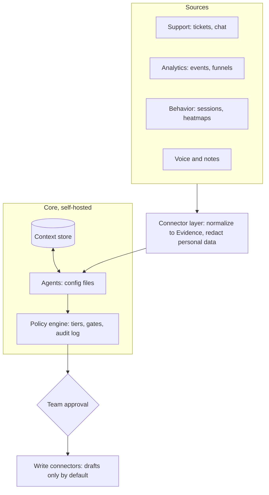

# Design

This document describes the framework as it is meant to be at 1.0. The README and the status
column at the end say what exists today.

## Release approach

An open-source, self-hosted framework. One install serves one product team, which brings its own
API keys and its own data.

| Decision | Choice | Why | Revisit when |
| --- | --- | --- | --- |
| Form | Open-source framework, self-hosted | Product data is sensitive, and hosting it for others adds a large security and compliance burden | Teams ask for a hosted option |
| Tenancy | One team per install | No cross-company isolation to get wrong. Scales from a solo PM to about ten people | A hosted option is chosen |
| Licence | Apache-2.0 | Permissive, includes a patent grant | n/a |
| Tool coverage | Connector interface plus a few reference connectors | We cannot support every tool, so others can add theirs | A connector gets heavy community use |
| Model | Claude by default, behind a provider interface | Keeps the first version simple without locking users in | Demand for other providers |

**Audience.** Product teams of one to ten that use a support tool, a product-analytics tool and a
work tracker, and want help turning that signal into decisions.

**Non-goals.** A hosted multi-tenant service in 1.0. Replacing the PM's judgment or acting without
approval. Writing or deploying code. Replying to customers.

## Principles

Product work has no test suite, so trust comes from structure.

1. **Every claim carries evidence.** No source means it is labeled an assumption.
2. **Agents propose, people decide.** Nothing that commits resources or leaves the install happens without approval.
3. **Disagreement is shown, not averaged.** Conflicts between agents, and the Red Team's objections, reach the human.
4. **Every decision is a falsifiable bet.** Each records a hypothesis, a metric and a threshold.
5. **Memory is the product.** The decision log and evidence ledger outlive any prompt or session.
6. **Small and legible beats clever.** One person must be able to inspect what each agent did and why.
7. **Read-mostly by default.** Agents read broadly and write only drafts.
8. **Tool-agnostic.** Nothing in the core knows about a specific vendor. That lives in connectors.
9. **Config over code.** Agents, gates and schedules are files a team edits.
10. **Local-first.** Data stays on the team's infrastructure, apart from the model provider the team chose.
11. **Safe defaults, explicit upgrades.** A fresh install is read-only with draft-only writes.

## Architecture

Sources are reached only through connectors, which normalize and redact before anything is
stored. Agents read and write the context store, and the policy engine checks each output against
tiers and gates. Anything bound for the team's real tools waits for a person's approval and leaves
through a draft-only write connector.

## Context store

Five record types, each with an id, a timestamp and links to the records it came from.

| Record | What it holds | Written by |
| --- | --- | --- |
| Strategy | Vision, goals, personas, constraints, what the team will not do | People only |
| Evidence | One verifiable observation with its source link | Collection agents |
| Theme | A cluster of evidence with a count, a trend and a confidence | Collection and analysis agents |
| Decision | A choice, options, rationale, dissent, hypothesis, metric, threshold, review date | Strategy agent, approved by a person |
| Outcome | What happened against a decision's hypothesis | Outcome agent |

SQLite by default, Postgres planned for larger teams. Rules the store enforces: evidence is
immutable, corrections are new records, strategy changes only through a person, and every write is
logged with agent, run id and time. A Decision cannot be approved without evidence or an explicit
"assumption" flag (planned with the decision agents).

## Agents

An agent is a file, not code. See [agent-format.md](agent-format.md).

| Agent | Job | Tier |
| --- | --- | --- |
| Orchestrator | Runs schedules, routes work, assembles digests | A |
| Signal Synthesizer | Clusters support and voice records into themes with counts, trend and verbatim quotes | A |
| Analyst | Adds quantitative and behavioral evidence to themes and says what the data cannot show | A |
| Strategist | Sizes opportunities, scores them against strategy, drafts a Decision | B |
| Red Team | Argues against the recommendation before every gate | C |
| Spec Writer | Drafts specs from an approved Decision, citing evidence for every requirement | B |
| Outcome Tracker | Compares results to each decision's hypothesis and writes the retro | B |
| Delivery Coordinator | Watches the work tracker for blocked work and drafts status updates | B |
| Stakeholder Comms | Rewrites the same update for each audience, adding no facts or figures | B |
| Researcher | Interview synthesis and competitor notes. Every finding carries a verbatim quote | B |

Tiers: **A** acts alone, **B** drafts for approval, **C** advises only.

## Team sizes

| Mode | Team | Who approves gates |
| --- | --- | --- |
| Solo | One PM | The PM, at every gate |
| Small team | 2 to 5 | Gates route by role |
| Larger team | 6 to 10 | Each PM owns their product's gates. A lead approves cross-product decisions |

## Control model

Tiers, gates (default: *prioritize* and *spec approval*), per-run and weekly token budgets, an
audit log of every run, and a pause-all switch. An agent that cannot find evidence for a claim marks
it as an assumption instead of filling the gap.

## Security and privacy

See [threat-model.md](threat-model.md).

## Evaluation

The framework ships a harness so a team can measure its own install: traceability, theme accuracy,
edit rate, calibration and cost per digest, plus golden sets and replay so a prompt, model or
connector change can be checked before it goes live. A synthetic demo dataset lives in
`examples/demo`.

## Roadmap

1. **Alpha (now).** The full loop is implemented. Next: run it for real teams and gather feedback.
2. **Private beta.** Freeze the connector interface and agent file format. Install and connector-author docs.
3. **Public 1.0.** Security review of the policy engine and connectors, a published threat model, a demo that runs on a clean machine.
4. **After 1.0.** Decide on a hosted option and more model providers from real demand.

## Status against this design

| Area | State |
| --- | --- |
| Store, evidence immutability, audit log, decision/dissent/spec/outcome records | Implemented |
| Connectors: Zendesk, JSONL, folder | Implemented |
| Connectors: Mixpanel, Clarity, ClickUp (draft-only) | Implemented |
| Redaction (pattern-based) | Implemented, no name detection |
| Agent files, policy engine, tiers, scoped access, token budgets | Implemented |
| Signal Synthesizer, Analyst, Strategist, Red Team, Spec Writer | Implemented |
| Outcome Tracker | Implemented, deterministic, no model |
| Gates: Red Team requirement, evidence-or-assumption rule, approver identity, spec approval before export | Implemented |
| Weekly orchestration | Implemented as `run weekly`. No built-in scheduler |
| Researcher, Delivery Coordinator, Stakeholder Comms | Implemented |
| Web-page connector (SSRF-guarded), ClickUp task reader | Implemented |
| Sending anything to people | Deliberately absent: updates are drafts a person approves and delivers |
| Postgres, per-role approval routing, per-person digests | Not started |
| Evidence corrections when a source record changes | Not started |
